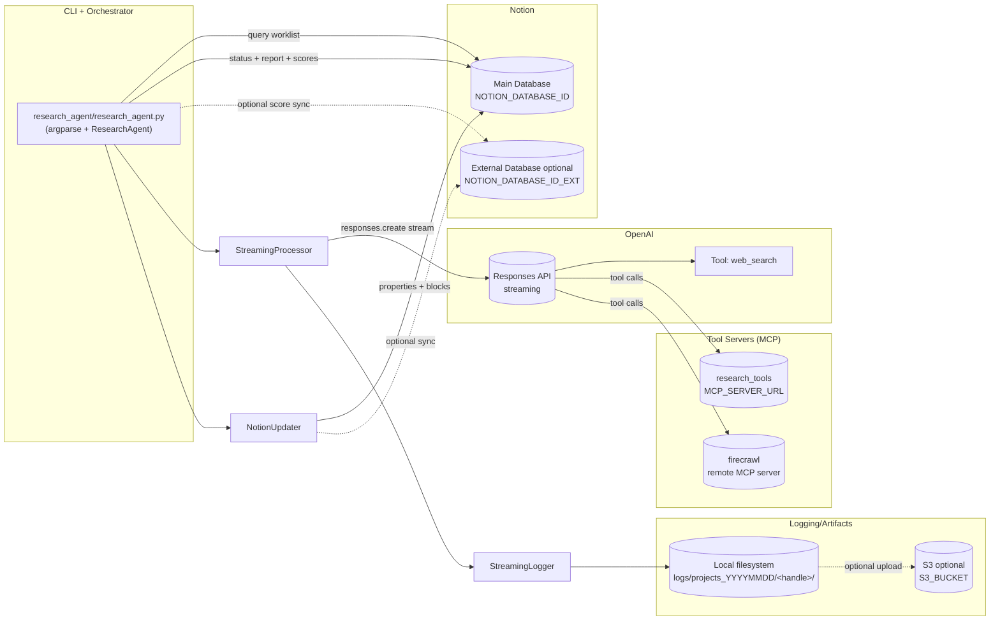

# Research Agent Architecture (High-Level)

This document describes the runtime architecture of the Research Agent implemented in `research_agent/research_agent.py` and the modules it coordinates.

## What It Does

The Research Agent:
- pulls a worklist of projects from a Notion database (or accepts a direct Twitter handle),
- runs an OpenAI streaming “research” call that can use tools (web search + MCP tool servers),
- writes local per-project logs/artifacts,
- updates the existing Notion page with the generated report and structured metadata (status, priority, stage, scores).

## Primary Components

- **CLI + Orchestrator** (`research_agent/research_agent.py`)
  - Parses CLI args, loads system prompt, validates configuration, and chooses run mode.
  - Queries Notion for “unresearched” projects and filters them (including “stuck” in-progress items).
  - Executes projects sequentially or in parallel using a `ThreadPoolExecutor`.
  - Applies status changes and writes score fields back to Notion.

- **Research Execution (Streaming)** (`research_agent/streaming_processor.py`)
  - Wraps the OpenAI Responses API streaming call.
  - Configures tools available to the model:
    - `web_search` (OpenAI-hosted)
    - MCP server labeled `research_tools` (configurable via `MCP_SERVER_URL`)
    - MCP server labeled `firecrawl` (remote)
  - Implements retry logic for 424 (MCP dependency), 429 (rate limiting), and 502/503 (infrastructure).

- **Streaming Event Logging** (`research_agent/streaming_logger.py`)
  - Consumes streaming chunks and writes artifacts per project:
    - `01_summary.log`, `02_reasoning.md`, `03_tools.jsonl`, `04_metrics.json`, `final_output.md`, `raw_events.jsonl`

- **Notion Persistence Layer** (`research_agent/notion_updater.py`)
  - Updates page properties (status/date/priority/stage, plus category score properties).
  - Converts markdown report output into Notion blocks and appends them (batched).
  - Optionally creates a child page for the reasoning file if `02_reasoning.md` exists in the project log folder.
  - Optionally syncs data into a second Notion database (`NOTION_DATABASE_ID_EXT`).

- **External Services**
  - **Notion API**: worklist source and destination for updates.
  - **OpenAI Responses API**: generates the research report and executes tool calls.
  - **MCP Server** (`MCP_SERVER_URL`): provides domain-specific tools the model can call.
  - **Firecrawl MCP** (remote): web extraction tool server available to the model.
  - **S3 (optional)** (`research_agent/s3_logs.py`): uploads per-project logs if AWS credentials are configured.

## Data & Artifacts

- **Session directory**: `logs/projects_YYYYMMDD/`
- **Per-project directory** (handle-based): `logs/projects_YYYYMMDD/<twitter_handle>/`
- **Notion outputs**:
  - Page properties updated (Research Status/Date/Priority/Stage + score properties)
  - Research content appended as blocks into the existing page

## Architecture Diagram



# OpenAI MCP Tools Server

A comprehensive Model Context Protocol (MCP) server that provides Twitter data retrieval and web scraping capabilities for OpenAI's Deep Research API.

## Features

### Twitter Tools
- **Profile Lookup**: Get detailed Twitter profile information including follower counts, bio, verification status
- **Following Analysis**: Analyze who a user follows with founder detection capabilities
- **Tweet Extraction**: Fetch recent tweets with comprehensive data including URLs and engagement metrics
- **Bulk Profile Fetching**: Efficiently retrieve multiple Twitter profiles at once

### Web Tools
- **Website Scraping**: Extract clean content from any website using Firecrawl
- **Web Search**: Search the web with automatic content scraping and structured results

## Quick Start

### 1. Installation

```bash
# Clone the repository
git clone https://github.com/carlhuareforge/mcptools.git
cd mcptools

# Install dependencies
pip install -r requirements.txt
```

### 2. Environment Setup

Create a `.env` file with your API keys:

```env
# Twitter API via RapidAPI
RAPID_API_KEY=your_rapidapi_key_here

# Firecrawl API for web scraping
FIRECRAWL_API_KEY=your_firecrawl_api_key_here
```

### 3. Start the MCP Server

```bash
python main.py
```

The server will start on `http://0.0.0.0:8000` and be accessible via SSE transport.

### 4. Connect to OpenAI Deep Research

Use the server URL in your OpenAI Deep Research configuration to access all tools.

## API Reference

### Twitter Tools

#### `get_twitter_profile(username: str)`
Get comprehensive Twitter profile information.

**Parameters:**
- `username`: Twitter username (with or without @)

**Returns:**
- Profile data including follower counts, bio, verification status, URLs

#### `get_twitter_following(username: str, oldest_first: bool = False)`
Analyze who a user follows with founder detection.

**Parameters:**
- `username`: Twitter username to analyze
- `oldest_first`: If True, returns oldest 50 followings (potential founders)

**Returns:**
- Following profiles with founder detection capabilities

#### `get_twitter_tweets(username: str, limit: int = 50)`
Extract recent tweets with comprehensive data.

**Parameters:**
- `username`: Twitter username
- `limit`: Number of tweets to fetch (default 50)

**Returns:**
- Tweet entries with text, engagement metrics, URLs, and metadata

#### `bulk_get_twitter_profiles(identifiers: List[str])`
Efficiently fetch multiple Twitter profiles.

**Parameters:**
- `identifiers`: List of usernames or User IDs (max 100)

**Returns:**
- Multiple user profiles with basic information

### Web Tools

#### `scrape_website(url: str)`
Scrape content from any website.

**Parameters:**
- `url`: The URL to scrape

**Returns:**
- Clean markdown content with images removed (max 125KB)

#### `search_web(query: str, limit: int = 5)`
Search the web with automatic content scraping.

**Parameters:**
- `query`: Search query string
- `limit`: Number of results (default 5, max 10)

**Returns:**
- Search results with scraped content, metadata, and structured data

## Testing

Run individual tool tests:

```bash
# Test Twitter profile lookup
python tests/test_twitter_profile.py

# Test Twitter following analysis
python tests/test_twitter_following.py

# Test Twitter tweet extraction
python tests/test_twitter_tweets.py

# Test bulk Twitter profiles
python tests/test_bulk_twitter.py

# Test web scraping
python tests/test_web_scraping.py

# Test web search
python tests/test_web_search.py

# Run all tests
python tests/run_all_tests.py
```

## Architecture

### Core Components

- **`main.py`**: MCP server implementation with FastMCP
- **`tools.py`**: Core tool implementations for Twitter and web operations
- **`api_test.py`**: OpenAI Deep Research API integration testing
- **`tests/`**: Comprehensive test suite for all tools

### Key Features

- **Robust Error Handling**: Graceful handling of API failures and rate limits
- **Founder Detection**: Specialized logic for identifying potential founders in following lists
- **URL Extraction**: Comprehensive URL extraction from tweet entities
- **Content Optimization**: Automatic content cleaning and size limiting
- **Rate Limit Management**: Intelligent handling of API rate limits

## API Keys Required

### RapidAPI (Twitter Tools)
1. Sign up at [RapidAPI](https://rapidapi.com/)
2. Subscribe to the Twitter API service
3. Get your API key and add it to `.env` as `RAPID_API_KEY`

### Firecrawl (Web Tools)
1. Sign up at [Firecrawl](https://firecrawl.dev/)
2. Get your API key from the dashboard
3. Add it to `.env` as `FIRECRAWL_API_KEY`

## Integration with OpenAI Deep Research

This MCP server is designed to work seamlessly with OpenAI's Deep Research API:

1. Start the MCP server (`python main.py`)
2. Configure OpenAI Deep Research to use the server URL
3. The AI can now access all Twitter and web tools for comprehensive research

## Example Usage

```python
# Through OpenAI Deep Research, you can now ask:
# "Analyze @elonmusk's Twitter profile and recent tweets"
# "Who does @sundarpichai follow? Focus on potential founders"
# "Search for information about 'AI safety' and scrape the top results"
# "Get bulk profiles for these Twitter users: ['elonmusk', 'sundarpichai', 'sama']"
```

## Contributing

1. Fork the repository
2. Create a feature branch
3. Add tests for new functionality
4. Submit a pull request

## License

This project is available under the PolyForm Noncommercial License 1.0.0. Commercial use requires a separate agreement with Reforge Capital LLC.

## Support

For issues and questions:
- Open an issue on GitHub
- Check the test files for usage examples
- Review the API documentation above
