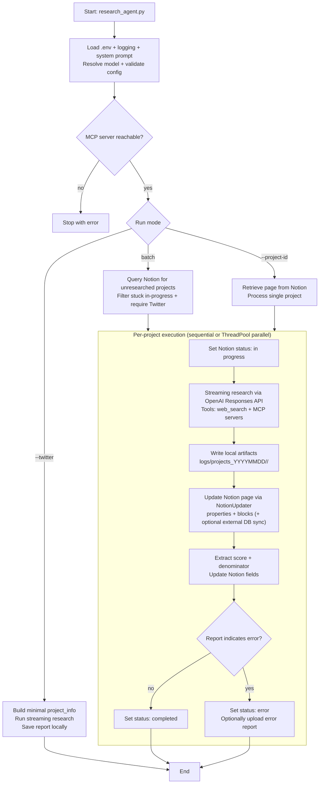

# Research Agent Workflow (Major Steps)

This document describes the end-to-end runtime pipeline driven by `research_agent/research_agent.py`.

## 1) Startup & Configuration

- Load environment variables (from `.env` files) and resolve required settings:
  - `OPENAI_API_KEY`, `NOTION_API_KEY`, `NOTION_DATABASE_ID`
  - `OPENAI_MODEL` (or `--model`)
  - `MCP_SERVER_URL` (defaults to `http://localhost:8000/sse`)
- Create a daily session directory for logs: `logs/projects_YYYYMMDD/`
- Load the system prompt markdown (`research_agent/research_agent_prompt_al.md` by default, or `--prompt`).
- Verify the MCP server is reachable before starting research.

## 2) Choose Run Mode (Worklist Source)

`research_agent.py` supports three modes:

- **Direct Twitter mode** (`--twitter`): research one handle without Notion writes (report is saved locally).
- **Single project mode** (`--project-id`): retrieve one Notion page and update it.
- **Batch mode** (default): query Notion for pages whose `Research Status` is empty / `not researched` / `error` / `in progress` (stuck items only), then process them.

## 3) Build & Filter the Worklist (Batch Mode)

- Query Notion using an OR filter across `Research Status`.
- Treat `in progress` items as eligible only if they are “stuck” (last edited more than ~2 hours ago).
- Optionally require a Twitter handle (default behavior).

## 4) Execute Research per Project (Sequential or Parallel)

For each project:

1. Extract normalized project info (`Name`, cleaned `Twitter`, `Summary`, status tags).
2. Set Notion `Research Status` to `in progress`.
3. Create a user query: `Research twitter profile @handle` (optionally overrides early-exit rules with `--override_research`).
4. Run streaming research:
   - `StreamingProcessor.process_research(...)` calls OpenAI’s streaming Responses API.
   - The model can use `web_search` and MCP tool servers.
   - `StreamingLogger` writes streaming artifacts into `logs/projects_YYYYMMDD/<handle>/`.
   - Logs may be uploaded to S3 if configured.
5. Persist results to Notion:
   - `NotionUpdater.update_item_with_research(...)` updates properties (priority/stage/date), extracts category scores, converts markdown to Notion blocks, and appends them to the page.
   - Optionally syncs to an external Notion database.
6. Extract `Raw Score` and `Denominator` from the report and update those fields in Notion (and external DB if configured).
7. Set final `Research Status` (`completed` or `error`) and log a per-project summary.

## 5) Error Handling & Early Termination

- **500/424 errors**: treated as “skip without upload” and counted. After a threshold, the run terminates early to avoid repeated failures.
- **Retryable errors inside streaming**:
  - 424 (MCP dependency): one retry is attempted.
  - 429 (flex mode) and 502/503: retries with backoff.
- **Notion upload failures**: the report is saved locally as a fallback and the page is marked `error`.

## Workflow Diagram

